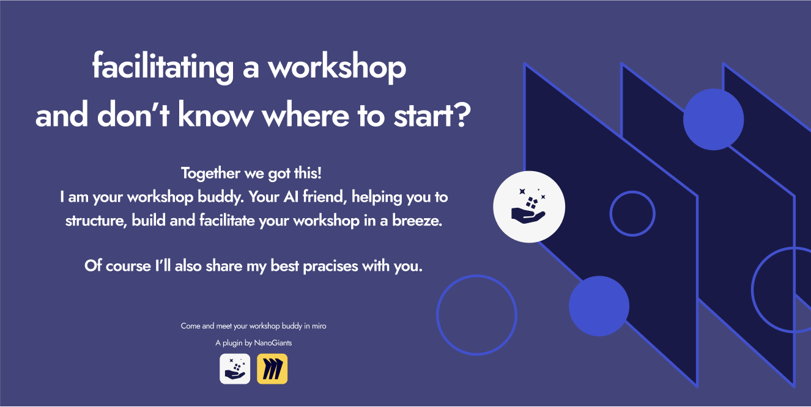
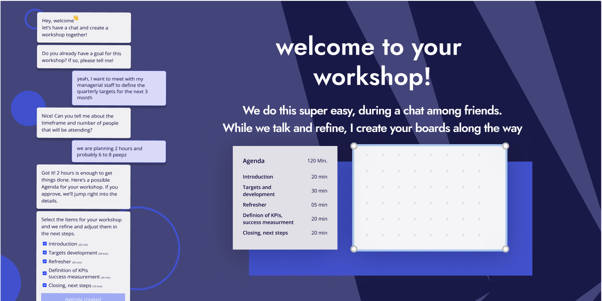
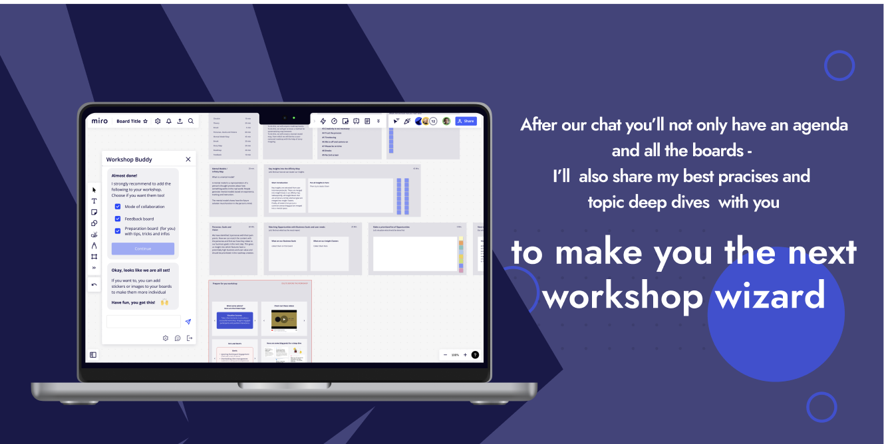

# Workshop Buddy
<!-- section: Introduction -->
<!-- Describe briefly what your software is. What problem does it solve? At what target audience is it aimed? -->

This is a miro plugin that helps you create workshops in miro with the power of AI.

By using the power of AI we tackled problems regarding creating compelling workshops for collaboration. We utilize both GPT-3.5 turbo and GPT-4 as well as function calling to let the user interact with our chatbot, who then creates custom tailored boards for your very own workshop. We have multiple agents in place, who are specialised for a dedicated task (i.e. planning, board creation, chat flows) to get the things done. Just chat with our chatbot, who tries to understand what you are trying to build and he interviews you in order to understand better. If he has enough knowledge, he creates the boards for your workshop for you. Update them if needed.

Workshop Buddy is your Miro collaboration game-changer, tackling the White Page Problem by transforming the daunting blank canvas into a streamlined and intuitive planning experience. No more staring at empty boards – Workshop Buddy is here to revolutionize your workshop efficiency.

This innovative AI plugin boasts lightning-speed planning, structuring, and board creation, offering a user-friendly chat interface for seamless communication between the buddy and the human. It guides users to articulate their workshop goals effortlessly, ensuring a clear and organized foundation for collaborative work.

Beyond its planning prowess, Workshop Buddy is your go-to guide for elevating workshop quality. With expert insights, it turns workshops into valuable learning experiences, bridging knowledge gaps and steering facilitators away from common mistakes. Seasoned facilitator or workshop novice, Workshop Buddy grounds your approach in proven strategies, maximizing collaborative potential in Miro.

Looking forward, Workshop Buddy's next upgrade introduces theming, allowing users to easily align boards with corporate colors. Future plans extend beyond workshops and presentations, envisioning Workshop Buddy as a versatile companion for creating visuals, building roadmaps, and even exploring voice-driven functionality. Brace yourself for a future where Workshop Buddy transcends boundaries, redefining collaborative possibilities in Miro.

## Overview
<!-- section: Overview -->
<!-- Give an architectural overview of your software. Is is interesting for other developers, who wants to catch on and want to developer features or fix bugs of your software. Do not go into too much detail. There are other documents for this. -->





## Changelog
<!-- section: Changelog --> 
<!-- Describe that changes made to the software by version. Note that this should be done automatically. -->

### Fixes
* 1b6a2cdefa - fix: simplify instructions for AI to get better results
* 0d1fde04ed - fix: fix correct rendering of miro board items

### Chores
* 96dde8736f - chore: fix local path issues
* a7ced6f60b - chore: add revokable open ai key for demo purpose
* 46af1b3810 - chore: implement loop
* 42031f425d - chore: add basic miro item builder
* ae0c883368 - chore: fix issue where last event persisted
* 4e3344a7aa - chore: add modal and fix some stylings
* 8e9bb2159e - chore: add basic onboarding
* 34f817ee6f - chore: add basic onboarding
* 1be37b971c - chore: remove unused code
* 153d0fce6b - chore: try to infer more information
* 548c829bb5 - chore: add agenda and detailed agenda items
* 21966c092c - chore: allow line breaks
* 9fd18d6959 - chore: try to find a good way to let the AI interview the user
* d4ddba1e71 - chore: add back links to settings and create workshop debug view
* 6c42351f1c - chore: stream response
* 2ab7d5dd4e - chore: disable chat when there is no API key
* cb9a4f502c - chore: add working chatbot with context
* f9cfcb06f4 - chore: apply correct style and fix some issues with styling
* 287c751c27 - chore: add store and sample usage in settings screen
* 30fdf2e228 - chore: add settings page and fix main layout
* 50758e0ba4 - chore: add basic router
* 95b9399510 - chore: add basic layout for chatbot
* 95222050bd - chore: add basic footer

### Refactors
* 0e262a8f31 - refactor: move building parts of miro sdk to dedicated use hooks
* 4b6604b6fb - refactor: big refactor and correctly build execution plan
* 5137f37579 - refactor: introduce styled components

### Documentation
* 30133ff7c3 - docs: reformat license in readme file
* f30111a016 - docs: add readme and license file

### Initial Commit
* 70f5360164 - Initial commit from Create Miro App


## Contributing
<!-- section: Contributing -->
<!-- Describe what action one should take in order to contribute. Does a certain styleguide has to be adhered. How can one apply changes (i.e. push vs. pull request)? -->
Bug reports and pull requests are welcome on GitHub at https://github.com/dasheck0/nanogiants-miro-workshop-buddy/issues. This project is intended to be a safe, welcoming space for collaboration, and contributors are expected to adhere to the Contributor Covenant code of conduct.

## License
<!-- section: License -->
<!-- Describe the license under which your software is published. Note that an unlicensed piece of software is most likely never used. So do not skip tihs part! -->
```
MIT License Copyright (c) 2024 Stefan Neidig

Permission is hereby granted, free
of charge, to any person obtaining a copy of this software and associated
documentation files (the "Software"), to deal in the Software without
restriction, including without limitation the rights to use, copy, modify, merge,
publish, distribute, sublicense, and/or sell copies of the Software, and to
permit persons to whom the Software is furnished to do so, subject to the
following conditions:

The above copyright notice and this permission notice
(including the next paragraph) shall be included in all copies or substantial
portions of the Software.

THE SOFTWARE IS PROVIDED "AS IS", WITHOUT WARRANTY OF
ANY KIND, EXPRESS OR IMPLIED, INCLUDING BUT NOT LIMITED TO THE WARRANTIES OF
MERCHANTABILITY, FITNESS FOR A PARTICULAR PURPOSE AND NONINFRINGEMENT. IN NO
EVENT SHALL THE AUTHORS OR COPYRIGHT HOLDERS BE LIABLE FOR ANY CLAIM, DAMAGES OR
OTHER LIABILITY, WHETHER IN AN ACTION OF CONTRACT, TORT OR OTHERWISE, ARISING
FROM, OUT OF OR IN CONNECTION WITH THE SOFTWARE OR THE USE OR OTHER DEALINGS IN
THE SOFTWARE.
```